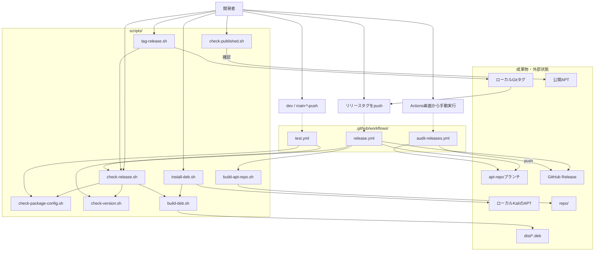

# 開発・リリースガイド

この文書は、ツールの実装からローカル確認、リリース、公開後監査までの開発者向け手順をまとめたものです。コマンドはすべてリポジトリのルートで実行します。

## 基本方針

- `dev`は開発用です。pushするとテストだけが実行されます。
- `main`はリリース可能なソースコードを管理します。pushだけでは公開されません。
- `apt-repo`はGitHub Actionsが生成したAPTリポジトリだけを保持します。
- APTとGitHub Releaseの公開は、`<tool>/v<version>`タグのpushだけを契機にします。
- `dist/`、`repo/dists/`、`repo/pool/`は生成物であり、`main`にはコミットしません。

各ツールのバージョンは次の3か所で一致させます。

```text
internal/<tool>/*.go              # Version定数
debian/<tool>/VERSION             # Debianパッケージのバージョン
<tool>/v<version>                 # リリースタグ
```

リリースノートは、バージョンごとに英語版と日本語版を用意します。

```text
releases/<tool>/<version>.md
releases/<tool>/<version>.ja.md
```

## 開発フロー

### 1. 実装とテスト

`dev`ブランチでコードとテストを変更します。Goの確認は親ディレクトリのKaliコンテナで実行します。

```sh
docker-compose exec -w /tools kali gofmt -w cmd internal
docker-compose exec -w /tools kali go test ./...
```

### 2. Kaliへローカルインストール

```sh
./scripts/install-deb.sh <tool>
```

現在のDebianアーキテクチャ向けパッケージを生成し、Kaliへ再インストールします。インストール後、CLIを手動操作して実際の動作を確認します。

### 3. リリース情報を更新

次のファイルを更新します。

```text
internal/<tool>/*.go
debian/<tool>/VERSION
releases/<tool>/<version>.md
releases/<tool>/<version>.ja.md
```

READMEには現在のバージョンを重複して記載しません。

### 4. リリース前検査

```sh
./scripts/check-release.sh <tool>
```

次の問題をpush前に検出します。

- `cmd/`、`internal/`、`debian/`の構成漏れ
- Goソースと`debian/<tool>/VERSION`の不一致
- 英語・日本語リリースノートの欠落
- `gofmt`、`go mod tidy -diff`、`go test ./...`の失敗
- 既存タグと現在のコミットの不整合
- `amd64`・`arm64`のビルド失敗
- Debianパッケージの名前、バージョン、アーキテクチャ、実行ファイルの不整合

この検査はAPTへのインストールや削除を行いません。インストール確認は`install-deb.sh`、リリース可能性の検査は`check-release.sh`が担当します。

### 5. devとmainを更新

```sh
git push origin dev
```

`dev`へのpushでは[`.github/workflows/test.yml`](../.github/workflows/test.yml)が実行されます。成功後、`dev`を`main`へマージして`main`をpushします。`main`でも同じテストが実行されますが、APTやGitHub Releaseは公開されません。

### 6. タグを作成して公開

cleanな`main`で実行します。

```sh
git switch main
./scripts/tag-release.sh <tool>
git push origin <tool>/v<version>
```

`tag-release.sh`は、ブランチ、作業ツリー、`origin/main`との一致、タグの重複、リリース前検査を確認してから、annotated tagをローカルに作成します。タグ自体は自動pushしません。

タグをpushすると[`.github/workflows/release.yml`](../.github/workflows/release.yml)が、そのタグのコミットだけを使って両アーキテクチャのパッケージを生成し、APTリポジトリとGitHub Releaseを公開します。

### 7. 公開後確認

```sh
./scripts/check-published.sh <tool>
```

公開先の`Packages.gz`と`amd64`・`arm64`パッケージを取得し、現在のVERSIONが公開されていることを確認します。既定の公開先は`https://offsec.batako.net`です。

```sh
APT_REPOSITORY_URL=https://example.com ./scripts/check-published.sh <tool>
```

## 呼び出し関係

実線は直接呼び出し、点線はGit操作または手動操作を契機にしたWorkflowの起動です。



## スクリプト

### 開発者が直接使うもの

| ファイル | 用途 | 主な結果 |
| --- | --- | --- |
| [`scripts/install-deb.sh`](../scripts/install-deb.sh) | 開発中のパッケージをKaliへ導入 | `dist/`、ローカルAPT状態 |
| [`scripts/check-release.sh`](../scripts/check-release.sh) | 1ツールのリリース前検査 | `dist/` |
| [`scripts/tag-release.sh`](../scripts/tag-release.sh) | 検査後にリリースタグを作成 | ローカルGitタグ |
| [`scripts/check-published.sh`](../scripts/check-published.sh) | 公開済みAPTを確認 | なし |

### 内部処理・個別調査用

| ファイル | 用途 | 呼び出し元 | 主な結果 |
| --- | --- | --- | --- |
| [`scripts/build-deb.sh`](../scripts/build-deb.sh) | 1ツール・1アーキテクチャの`.deb`を生成 | `install-deb.sh`、`check-release.sh`（`release.yml`からも間接実行） | `dist/` |
| [`scripts/build-apt-repo.sh`](../scripts/build-apt-repo.sh) | `dist/*.deb`からAPTインデックスを再生成 | `release.yml` | `repo/` |
| [`scripts/check-package-config.sh`](../scripts/check-package-config.sh) | 全ツールの構成、リリースノート、ctx利用パッケージのDebian依存を検査 | `test.yml`、`check-release.sh`（`release.yml`からも間接実行） | なし |
| [`scripts/check-ctx-integration.sh`](../scripts/check-ctx-integration.sh) | ctx外部連携仕様の日英文書、固定実行パス、共通JSONクライアント、Debian依存、連携仕様テストを一括監査 | `test.yml` | なし |
| [`scripts/check-version.sh`](../scripts/check-version.sh) | GoソースとDebian VERSIONを照合 | `test.yml`、`check-release.sh`（`release.yml`からも間接実行） | なし |

内部スクリプトは障害調査や個別確認のために直接実行できますが、通常の開発で順番にすべて実行する必要はありません。

```sh
./scripts/build-deb.sh <tool> [amd64|arm64]
./scripts/build-apt-repo.sh
./scripts/check-package-config.sh
./scripts/check-ctx-integration.sh
./scripts/check-version.sh <tool>
```

## GitHub Actions

### `test.yml`

[`.github/workflows/test.yml`](../.github/workflows/test.yml)は`dev`または`main`へのpushで起動し、公開処理は行いません。

```text
test.yml
├── gofmt
├── go mod tidy -diff
├── go test ./...
├── check-package-config.sh
├── check-ctx-integration.sh
└── check-version.sh（cmd/*の全ツール）
```

ツール一覧は`cmd/*`から動的に取得するため、新しいツール名をWorkflowへ個別追加する必要はありません。

### `release.yml`

[`.github/workflows/release.yml`](../.github/workflows/release.yml)は`<tool>/v<version>`タグのpushで起動する唯一の公開Workflowです。

```text
release.yml
├── タグ名、VERSION、main所属を検証
├── check-release.sh
│   ├── check-package-config.sh
│   ├── check-version.sh
│   └── build-deb.sh（amd64・arm64）
├── 公開済み同一バージョンの上書きを防止
├── build-apt-repo.sh
├── apt-repoブランチを更新
└── GitHub Releaseを作成
```

公開処理は同時実行されないよう直列化されています。同じファイル名の`.deb`が既に存在し、その内容が異なる場合はAPTを更新せず失敗します。

### `audit-releases.yml`

[`.github/workflows/audit-releases.yml`](../.github/workflows/audit-releases.yml)はActions画面からのみ起動する監査Workflowです。公開状態を変更しません。

全リリースタグについて次を確認します。

- `apt-repo`に`amd64`・`arm64`の`.deb`が存在する
- Debianパッケージのメタデータがタグと一致する
- APTの`Packages`にパッケージが登録されている
- リポジトリに英語・日本語リリースノートがある
- GitHub Releaseが公開済みで本文がある

## 新しいツールを追加するとき

最低限、次の構成を追加します。

```text
cmd/<tool>/
internal/<tool>/
debian/<tool>/VERSION
debian/<tool>/control
releases/<tool>/<version>.md
releases/<tool>/<version>.ja.md
```

追加後に`./scripts/check-package-config.sh`を実行します。パッケージ一覧は`cmd/*`から取得されるため、通常はビルドスクリプトやWorkflowへツール名を追加する必要はありません。

production Goコードが`internal/ctx`、`internal/ctxapi`、`internal/ctxexec`のいずれかをimportする場合、`debian/<tool>/control`の`Depends`へ`ctx`を含める必要があります。`check-package-config.sh`はこの対応をローカルと`test.yml`の両方で検査します。

ただし、ツール固有の処理をWorkflowへ追加する必要がある設計変更を行った場合は、`test.yml`、`release.yml`、`audit-releases.yml`のすべてを確認します。
