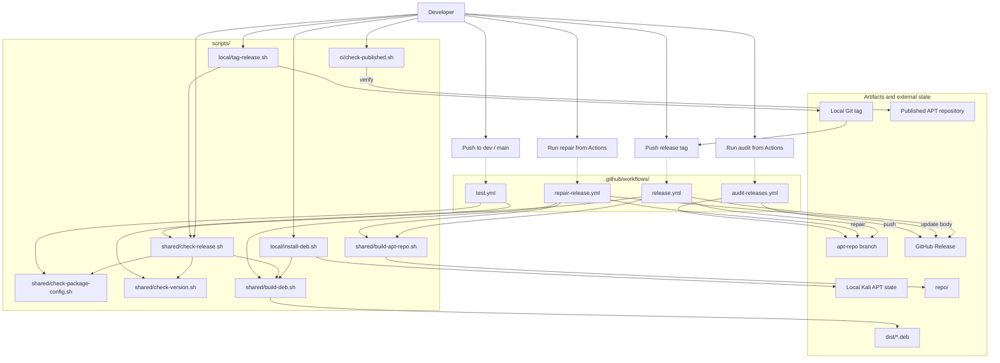

# Development and Release Guide

This document describes the developer workflow from tool implementation and local verification through release and post-publication audits. Run all commands from the repository root.

## Principles

- `dev` is the development branch. Pushes run tests only.
- `main` contains release-ready source code. A push alone does not publish anything.
- `apt-repo` contains only the APT repository generated by GitHub Actions.
- APT and GitHub Releases are published only when a `<tool>/v<version>` tag is pushed.
- `dist/`, `repo/dists/`, and `repo/pool/` are generated artifacts and must not be committed to `main`.

Keep each tool's version consistent in these three locations:

```text
internal/<tool>/*.go              # Version constant
debian/<tool>/VERSION             # Debian package version
<tool>/v<version>                 # Release tag
```

Provide English and Japanese release notes for each version:

```text
releases/<tool>/<version>.md
releases/<tool>/<version>.ja.md
```

## Development Flow

### 1. Implement and Test

Change code and tests on the `dev` branch. Run Go checks in the Kali container configured in the parent directory.

```sh
gofmt -w cmd internal
go test ./...
```

### 2. Install Locally on Kali

```sh
./scripts/local/install-deb.sh <tool>
```

This builds a package for the current Debian architecture and reinstalls it on Kali. After installation, operate the CLI manually to verify its actual behavior.

### 3. Update Release Information

Update the following files:

```text
internal/<tool>/*.go
debian/<tool>/VERSION
releases/<tool>/<version>.md
releases/<tool>/<version>.ja.md
```

Do not duplicate current version numbers in the README files.

### 4. Run Pre-release Checks

```sh
./scripts/shared/check-release.sh <tool>
```

This detects the following problems before a push:

- Missing files under `cmd/`, `internal/`, or `debian/`
- A mismatch between the Go source and `debian/<tool>/VERSION`
- Missing English or Japanese release notes
- Failures from `gofmt`, `go mod tidy -diff`, or `go test ./...`
- A mismatch between an existing tag and the current commit
- `amd64` or `arm64` build failures
- Incorrect Debian package name, version, architecture, or executable

This check does not install or remove APT packages. Use `install-deb.sh` to verify installation and `check-release.sh` to verify release readiness.

### 5. Update dev and main

```sh
git push origin dev
```

A push to `dev` runs [`.github/workflows/test.yml`](../.github/workflows/test.yml). After it succeeds, merge `dev` into `main` and push `main`. The same tests run on `main`, but no APT package or GitHub Release is published.

### 6. Create and Publish a Tag

Run these commands from a clean `main` branch:

```sh
git switch main
./scripts/local/tag-release.sh <tool>
git push origin <tool>/v<version>
```

`tag-release.sh` checks the branch, working tree, agreement with `origin/main`, duplicate tags, and pre-release checks before creating an annotated tag locally. It does not push the tag automatically.

Pushing the tag starts [`.github/workflows/release.yml`](../.github/workflows/release.yml). The workflow uses only the tagged commit to build packages for both architectures and publish the APT repository and GitHub Release.

### 7. Verify the Published Release

```sh
./scripts/ci/check-published.sh <tool>
```

This downloads the published `Packages.gz` and the `amd64` and `arm64` packages, then verifies that the current VERSION is available. The default publication URL is `https://offsec.batako.net`.

```sh
APT_REPOSITORY_URL=https://example.com ./scripts/ci/check-published.sh <tool>
```

## Invocation Relationships

Solid lines represent direct calls. Dotted lines represent workflows triggered by Git operations or manual actions.



## Scripts

### Used Directly by Developers

| File | Purpose | Main result |
| --- | --- | --- |
| [`scripts/local/install-deb.sh`](../scripts/local/install-deb.sh) | Install a package under development on Kali | `dist/`, local APT state |
| [`scripts/shared/check-release.sh`](../scripts/shared/check-release.sh) | Run pre-release checks for one tool | `dist/` |
| [`scripts/local/tag-release.sh`](../scripts/local/tag-release.sh) | Create a release tag after validation | Local Git tag |
| [`scripts/ci/check-published.sh`](../scripts/ci/check-published.sh) | Verify the published APT repository | None |

### Internal Processing and Individual Investigation

| File | Purpose | Called by | Main result |
| --- | --- | --- | --- |
| [`scripts/shared/build-deb.sh`](../scripts/shared/build-deb.sh) | Build one `.deb` for one tool and architecture | `local/install-deb.sh`, `shared/check-release.sh` (and indirectly `release.yml`) | `dist/` |
| [`scripts/shared/build-apt-repo.sh`](../scripts/shared/build-apt-repo.sh) | Rebuild APT indexes from `dist/*.deb` | `release.yml` | `repo/` |
| [`scripts/shared/check-package-config.sh`](../scripts/shared/check-package-config.sh) | Validate every tool's structure, release notes, and Debian dependency on ctx where required | `test.yml`, `shared/check-release.sh` (and indirectly `release.yml`) | None |
| [`scripts/shared/check-ctx-integration.sh`](../scripts/shared/check-ctx-integration.sh) | Audit the English and Japanese ctx integration documentation, fixed executable path, shared JSON client, Debian dependencies, and integration tests | `test.yml` | None |
| [`scripts/shared/check-version.sh`](../scripts/shared/check-version.sh) | Compare the Go source version with the Debian VERSION | `test.yml`, `shared/check-release.sh` (and indirectly `release.yml`) | None |

Internal scripts may be run directly for troubleshooting or individual checks, but normal development does not require running all of them in sequence.

```sh
./scripts/shared/build-deb.sh <tool> [amd64|arm64]
./scripts/shared/build-apt-repo.sh
./scripts/shared/check-package-config.sh
./scripts/shared/check-ctx-integration.sh
./scripts/shared/check-version.sh <tool>
```

## GitHub Actions

### `test.yml`

[`.github/workflows/test.yml`](../.github/workflows/test.yml) starts on pushes to `dev` or `main` and does not publish anything.

```text
test.yml
├── gofmt
├── go mod tidy -diff
├── go test ./...
├── check-package-config.sh
├── check-ctx-integration.sh
└── check-version.sh (all tools under cmd/*)
```

The workflow discovers tools dynamically from `cmd/*`, so new tool names do not need to be added individually.

### `release.yml`

[`.github/workflows/release.yml`](../.github/workflows/release.yml) is the only publication workflow. It starts when a `<tool>/v<version>` tag is pushed.

```text
release.yml
├── Validate the tag name, VERSION, and membership in main
├── shared/check-release.sh
│   ├── shared/check-package-config.sh
│   ├── shared/check-version.sh
│   └── shared/build-deb.sh (amd64 and arm64)
├── Prevent replacement of a published package with different content
├── shared/build-apt-repo.sh
├── Update the apt-repo branch
└── Create the GitHub Release
```

Publication jobs are serialized to prevent concurrent updates. If a `.deb` with the same filename already exists but has different content, the workflow fails without updating APT.

### `repair-release.yml`

[`.github/workflows/repair-release.yml`](../.github/workflows/repair-release.yml) is a manually triggered workflow for repairing the APT package or GitHub Release body of an existing release. Do not use it for normal releases.

In the Actions UI, select `apt-repository` or `release-notes` as the repair target, enter an existing tag in the form `xgobuster/v1.1.0`, and enable the confirmation input that permits published content to be replaced.

- An APT repair rebuilds the `amd64` and `arm64` packages from the existing tag, replaces the target files, and updates the APT indexes.
- A release notes repair updates only the existing GitHub Release body using `releases/<tool>/<version>.md` from `main`.
- Tags, GitHub Release assets, and unrelated versions are not modified.
- The workflow fails if the tag does not exist, is not contained in `main`, or does not match VERSION.

Normal releases and APT repairs use the same concurrency group, so they cannot update the APT repository simultaneously.

### `audit-releases.yml`

[`.github/workflows/audit-releases.yml`](../.github/workflows/audit-releases.yml) is a read-only audit workflow started manually from the Actions UI.

It checks the following for every release tag:

- The `amd64` and `arm64` `.deb` files exist in `apt-repo`.
- Debian package metadata matches the tag.
- The executable in the `amd64` package reports the tagged version.
- The package is registered in the APT `Packages` index.
- English and Japanese release notes exist in the repository.
- The GitHub Release exists and its body matches the English release notes.

## Adding a Tool

Add at least the following structure:

```text
cmd/<tool>/
internal/<tool>/
debian/<tool>/VERSION
debian/<tool>/control
releases/<tool>/<version>.md
releases/<tool>/<version>.ja.md
```

Then run `./scripts/shared/check-package-config.sh`. The package list is discovered from `cmd/*`, so tool names normally do not need to be added to build scripts or workflows.

If production Go code imports `internal/ctx`, `internal/ctxapi`, or `internal/ctxexec`, include `ctx` in `Depends` in `debian/<tool>/control`. `check-package-config.sh` validates this both locally and in `test.yml`.

If a design change requires tool-specific workflow processing, review `test.yml`, `release.yml`, `repair-release.yml`, and `audit-releases.yml`.
